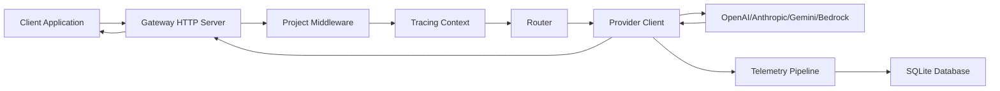

## Overview

The vLLora gateway is a lightweight, high-performance AI proxy built with Rust that sits between your applications and AI providers. It provides unified access to multiple LLM providers through an OpenAI-compatible API while adding real-time tracing, routing capabilities, and cost optimization.

## Architecture Components

### Core Services

The gateway is organized into several key components:

<CardGroup cols={2}>
  <Card title="HTTP Server" icon="server">
    Actix-based web server handling REST API requests on port 9090
  </Card>
  <Card title="UI Server" icon="browser">
    Web interface for configuration and monitoring on port 9091
  </Card>
  <Card title="OTEL gRPC Collector" icon="chart-line">
    OpenTelemetry collector for traces and metrics ingestion
  </Card>
  <Card title="MCP Server" icon="plug">
    Model Context Protocol server for advanced integrations
  </Card>
</CardGroup>

### Request Flow



<Steps>
  <Step title="Request Reception">
    The HTTP server receives an OpenAI-compatible request at `/v1/chat/completions`
  </Step>
  <Step title="Middleware Processing">
    Request flows through middleware layers:
    - **ProjectMiddleware**: Resolves the project context
    - **TracingContext**: Initializes OpenTelemetry spans
    - **TraceLogger**: Logs request details
    - **RunId/ThreadId**: Assigns unique identifiers
  </Step>
  <Step title="Routing Decision">
    The router evaluates the request based on configured strategy:
    - Fallback routing
    - Percentage-based A/B testing
    - Metric-optimized selection
    - Conditional routing
  </Step>
  <Step title="Provider Execution">
    The selected provider client executes the request with proper credential management
  </Step>
  <Step title="Response Streaming">
    Responses are streamed back to the client while simultaneously captured for tracing
  </Step>
</Steps>

## Key Features

### Unified Provider Interface

The gateway abstracts provider-specific implementations:

- **OpenAI**: Standard OpenAI API and Azure OpenAI endpoints
- **Anthropic**: Claude models via the Messages API
- **Google Gemini**: Gemini models with Vertex AI support
- **AWS Bedrock**: Multi-model access through Bedrock Runtime

### Routing Strategies

The gateway supports multiple routing strategies defined in `core/src/routing/mod.rs`:

<CodeGroup>
```rust Fallback
RoutingStrategy::Fallback
// Routes to the first available target, falling back to next on failure
```

```rust Percentage-based
RoutingStrategy::Percentage {
    targets_percentages: vec![0.7, 0.3]
}
// A/B testing with weighted distribution
```

```rust Optimized
RoutingStrategy::Optimized {
    metric: MetricSelector::Latency
}
// Routes based on performance metrics
```

```rust Conditional
RoutingStrategy::Conditional {
    routing: ConditionalRouting { ... }
}
// Routes based on request content or context
```
</CodeGroup>

### Credential Management

The gateway includes a secure credential storage system:

- **KeyStorage**: Stores encrypted API keys in SQLite
- **ProviderKeyResolver**: Resolves credentials per project and provider
- **Multiple Auth Methods**: API keys, AWS IAM, service accounts

## Database Layer

The gateway uses SQLite for metadata storage with Diesel ORM:

<Accordion title="Database Schema">
  - **projects**: Project configurations and settings
  - **providers**: Provider definitions and endpoints
  - **provider_credentials**: Encrypted API keys
  - **models**: Available model definitions
  - **traces**: OpenTelemetry trace data
  - **runs**: Execution run metadata
  - **threads**: Conversation thread tracking
</Accordion>

Database initialization happens in `core/src/metadata/utils.rs` with automatic migrations.

## Telemetry Integration

The gateway initializes OpenTelemetry tracing in `gateway/src/tracing.rs`:

```rust
pub fn init_tracing(
    project_trace_senders: Arc<ProjectTraceMap>,
    run_span_buffer: Arc<RunSpanBuffer>,
    db_pool: Option<DbPool>,
)
```

This sets up:
- **Span Exporters**: Export traces to OTLP endpoints and SQLite
- **Baggage Processor**: Propagates context (run_id, thread_id, project_id)
- **Meter Provider**: Collects and exports metrics
- **UUID ID Generator**: Generates trace IDs as UUIDs for easier querying

<Note>
The gateway automatically captures all LLM interactions as distributed traces without requiring code changes in your application.
</Note>

## Configuration

The gateway accepts configuration via:

1. **Environment Variables**: `RUST_LOG`, provider API keys
2. **CLI Arguments**: Port numbers, database path
3. **Database Settings**: Per-project configuration

## Performance Characteristics

- **Startup Time**: Fast startup with embedded models data JSON
- **Concurrency**: Async/await throughout, handles thousands of concurrent requests
- **Memory**: Efficient buffering with configurable flush intervals
- **Latency Overhead**: Minimal (< 10ms) for request routing

<Tip>
The gateway runs entirely locally with no data sent to external services except your configured AI providers.
</Tip>