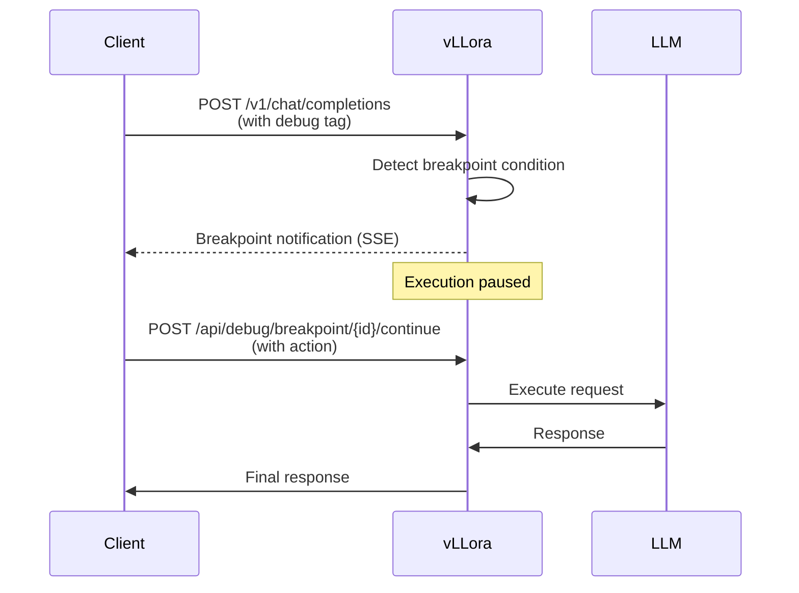

vLLora provides powerful interactive debugging capabilities that allow you to pause agent execution, inspect requests, and modify behavior in real-time. This is invaluable for understanding agent decision-making and troubleshooting complex workflows.

## Overview

The debugging system is built around **breakpoints** - points where vLLora pauses request execution and waits for your input. During a breakpoint, you can:

- Inspect the full request context
- View accumulated events and tool calls
- Modify the request before continuing
- Cancel the request entirely

<CardGroup cols={2}>
  <Card title="Request inspection" icon="magnifying-glass">
    Examine prompts, messages, and parameters before LLM calls
  </Card>
  <Card title="Live modification" icon="pen-to-square">
    Edit requests on-the-fly without restarting your application
  </Card>
  <Card title="Event tracking" icon="list-check">
    See all events that occurred before the breakpoint
  </Card>
  <Card title="Global control" icon="globe">
    Intercept all requests or just specific tagged ones
  </Card>
</CardGroup>

## How breakpoints work

When a request hits a breakpoint:

1. **Execution pauses** - The request handler suspends before making the LLM call
2. **Notification sent** - A breakpoint event is broadcast to connected clients
3. **Waiting for action** - vLLora waits for you to provide a `BreakpointAction`
4. **Continuation** - Execution resumes with the original or modified request



## Setting breakpoints

### Global breakpoint

Intercept all requests:

```bash
curl -X POST http://localhost:9090/api/debug/breakpoint/global \
  -H "Content-Type: application/json" \
  -d '{"enabled": true}'
```

Now every request will pause at a breakpoint, regardless of tags.

<Warning>
Global breakpoints affect all requests. Use with caution in shared environments.
</Warning>

### Tag-based breakpoints

Intercept only specific requests by adding a debug tag:

```bash
curl http://localhost:9090/v1/chat/completions \
  -H "Content-Type: application/json" \
  -d '{
    "model": "gpt-4o",
    "messages": [{"role": "user", "content": "Hello"}],
    "extra": {
      "tags": ["debug"]
    }
  }'
```

Requests with the `debug` tag will pause at breakpoints.

## Handling breakpoints

### List active breakpoints

```bash
curl http://localhost:9090/api/debug/breakpoints
```

Returns all currently paused requests:

```json
{
  "breakpoints": [
    {
      "id": "bp_abc123",
      "thread_id": "thread_xyz",
      "request": {
        "model": "gpt-4o",
        "messages": [...],
        "extra": {...}
      },
      "events": [
        {"type": "model", "data": {...}},
        {"type": "tool", "data": {...}}
      ],
      "created_at": "2024-01-15T10:30:00Z"
    }
  ]
}
```

### Continue with original request

Resume execution without modifications:

```bash
curl -X POST http://localhost:9090/api/debug/breakpoint/bp_abc123/continue \
  -H "Content-Type: application/json" \
  -d '{"action": "continue"}'
```

### Modify and continue

Change the request before continuing:

```bash
curl -X POST http://localhost:9090/api/debug/breakpoint/bp_abc123/continue \
  -H "Content-Type: application/json" \
  -d '{
    "action": "modify",
    "request": {
      "model": "gpt-4o-mini",
      "messages": [
        {"role": "system", "content": "You are a helpful assistant."},
        {"role": "user", "content": "Modified prompt"}
      ],
      "temperature": 0.5
    }
  }'
```

The LLM call will use the modified request instead of the original.

### Continue all breakpoints

Resume all paused requests at once:

```bash
curl -X POST http://localhost:9090/api/debug/breakpoints/continue-all
```

## Breakpoint implementation

The breakpoint system is implemented in `core/src/executor/chat_completion/breakpoint.rs`:

### BreakpointManager

```rust
pub struct BreakpointManager {
    pending_breakpoints: Arc<Mutex<HashMap<String, oneshot::Sender<BreakpointAction>>>>,
    breakpoint_requests: Arc<Mutex<HashMap<String, RequestWithThreadId>>>,
    intercept_all: Arc<AtomicBool>,
    events_storage: Arc<Mutex<HashMap<String, Vec<Event>>>>,
}
```

- **pending_breakpoints** - Active breakpoints waiting for action
- **breakpoint_requests** - Stored request context
- **intercept_all** - Global breakpoint flag
- **events_storage** - Events accumulated before breakpoint

### BreakpointAction

```rust
pub enum BreakpointAction {
    Continue,
    ModifyRequest(Box<ChatCompletionRequest>),
}
```

- **Continue** - Resume with original request
- **ModifyRequest** - Resume with modified request

## Use cases

### Debugging agent loops

When an agent enters an infinite loop, set a global breakpoint to see what's happening:

```bash
# Enable global breakpoint
curl -X POST http://localhost:9090/api/debug/breakpoint/global \
  -d '{"enabled": true}'

# Trigger the agent
curl http://localhost:9090/v1/chat/completions -d '{...}'

# List breakpoints to see the problematic request
curl http://localhost:9090/api/debug/breakpoints

# Modify the request to break the loop
curl -X POST http://localhost:9090/api/debug/breakpoint/{id}/continue \
  -d '{"action": "modify", "request": {...}}'
```

### Testing prompt variations

Experiment with different prompts without changing code:

```bash
# Send request with debug tag
curl http://localhost:9090/v1/chat/completions \
  -d '{
    "model": "gpt-4o",
    "messages": [{"role": "user", "content": "Original prompt"}],
    "extra": {"tags": ["debug"]}
  }'

# Modify the prompt at the breakpoint
curl -X POST http://localhost:9090/api/debug/breakpoint/{id}/continue \
  -d '{
    "action": "modify",
    "request": {
      "messages": [{"role": "user", "content": "Improved prompt"}]
    }
  }'
```

### Inspecting tool calls

See exactly what tools an agent plans to call:

```bash
# Enable breakpoint for tool-heavy workflow
curl http://localhost:9090/v1/chat/completions \
  -d '{"extra": {"tags": ["debug"]}, ...}'

# At breakpoint, check accumulated events
curl http://localhost:9090/api/debug/breakpoints
# Response includes all prior tool calls in "events" array

# Continue or modify based on tool usage
curl -X POST http://localhost:9090/api/debug/breakpoint/{id}/continue \
  -d '{"action": "continue"}'
```

### Cost control

Intercept expensive requests and switch to cheaper models:

```bash
# Breakpoint triggers for expensive model
curl http://localhost:9090/api/debug/breakpoints
# See: "model": "gpt-4o"

# Switch to cheaper model
curl -X POST http://localhost:9090/api/debug/breakpoint/{id}/continue \
  -d '{
    "action": "modify",
    "request": {"model": "gpt-4o-mini"}
  }'
```

## Web UI integration

The vLLora UI provides a visual debugging interface:

1. **Breakpoint indicator** - Shows when requests are paused
2. **Request viewer** - Displays the full request context
3. **Event timeline** - Shows accumulated events before breakpoint
4. **Modification panel** - Edit request fields inline
5. **Action buttons** - Continue, modify, or cancel

Navigate to http://localhost:9091/debug to access the debugging interface.

## Automatic cleanup

Breakpoints are automatically cleaned up if:

- The client disconnects during a breakpoint
- A timeout is reached (configurable)
- The request is explicitly cancelled

```rust
// From breakpoint.rs
impl Drop for BreakpointReceiverGuard {
    fn drop(&mut self) {
        if !self.completed {
            self.span.record("error", "Request cancelled while waiting for breakpoint action");
            // Spawn cleanup task
            tokio::spawn(async move {
                breakpoint_manager.remove_breakpoint(&breakpoint_id).await;
            });
        }
    }
}
```

## Best practices

<AccordionGroup>
  <Accordion title="Use tags instead of global breakpoints">
    Global breakpoints affect all requests, which can be disruptive in shared environments. Prefer tagging specific requests with `"tags": ["debug"]`.
  </Accordion>

  <Accordion title="Monitor breakpoint duration">
    Don't leave requests paused indefinitely. Implement timeouts or automatic cleanup to prevent resource leaks.
  </Accordion>

  <Accordion title="Log modifications">
    When modifying requests at breakpoints, log the changes for future reference. This helps track what was changed and why.
  </Accordion>

  <Accordion title="Combine with tracing">
    Use breakpoints together with tracing to get complete visibility. Traces show what happened before the breakpoint, breakpoints let you control what happens next.
  </Accordion>

  <Accordion title="Test in development first">
    Experiment with breakpoints in development environments before using them in production. Understand their impact on latency and user experience.
  </Accordion>
</AccordionGroup>

## Troubleshooting

### Breakpoint not triggering

Ensure the request includes the debug tag:

```json
{
  "extra": {
    "tags": ["debug"]
  }
}
```

Or enable global breakpoints:

```bash
curl -X POST http://localhost:9090/api/debug/breakpoint/global -d '{"enabled": true}'
```

### Request timeout at breakpoint

Increase the client timeout or respond to breakpoints more quickly. Clients may time out if breakpoints are held too long.

### Modified request not working

Verify the modified request is valid JSON and includes all required fields (model, messages).

## Next steps

<CardGroup cols={2}>
  <Card title="Tracing" icon="chart-line" href="/features/tracing">
    Learn about real-time tracing
  </Card>
  <Card title="Monitoring" icon="gauge" href="/guides/monitoring">
    Set up comprehensive monitoring
  </Card>
  <Card title="API reference" icon="code" href="/api/chat-completions">
    Chat completions API documentation
  </Card>
  <Card title="Examples" icon="flask" href="/examples/rust-streaming">
    See debugging in action
  </Card>
</CardGroup>
