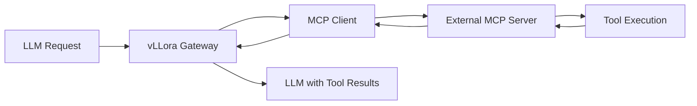

vLLora provides comprehensive support for the Model Context Protocol (MCP), enabling seamless integration between large language models and external tools, databases, and services.

## What is MCP?

The Model Context Protocol is a standard for connecting LLMs to external context and tools. It allows models to:

- **Access external data** - Query databases, APIs, and file systems
- **Execute actions** - Perform operations beyond text generation
- **Maintain context** - Preserve state across multiple interactions
- **Extend capabilities** - Add custom functionality specific to your use case

<Note>
MCP support in vLLora is based on the [rmcp](https://github.com/rust-mcp/rmcp) Rust implementation, providing both client and server functionality.
</Note>

## Architecture

vLLora implements MCP in two ways:

### 1. Built-in MCP server

vLLora exposes its own MCP server that provides tools for querying traces and debugging:

```rust
// Built-in tools available via vLLora MCP server
- search_traces      // Search telemetry data
- get_llm_call       // Get LLM call details
- get_run_overview   // Analyze agent runs
- get_recent_stats   // Monitor system health
```

This allows AI agents to introspect vLLora's observability data.

### 2. MCP client for external servers

vLLora can connect to external MCP servers and make their tools available to LLMs:



## Configuring MCP servers

### Via Web UI

Configure MCP servers through the vLLora web interface:

1. Navigate to **Settings** → **MCP Configuration**
2. Click **Add MCP Server**
3. Provide server details (transport type, URL, authentication)
4. Select which tools to enable
5. Click **Save**

### Via API

Configure MCP servers programmatically:

```bash
curl -X POST http://localhost:9090/api/mcp/configs \
  -H "Content-Type: application/json" \
  -d '{
    "name": "wiki_search",
    "transport": {
      "type": "sse",
      "url": "http://localhost:3000/sse"
    },
    "auth": {
      "type": "bearer",
      "token": "your-api-key"
    },
    "tools": ["search", "get_article"]
  }'
```

### Via Rust SDK

Define MCP servers in your Rust code:

```rust
use vllora_llm::mcp::{McpDefinition, McpTransportType};

let mcp_config = McpDefinition {
    name: "database_search".to_string(),
    transport_type: McpTransportType::Sse {
        url: "http://localhost:3000/sse".to_string(),
    },
    auth: None,
    tool_filter: None, // Enable all tools
    env: HashMap::new(),
};
```

## Transport types

vLLora supports multiple MCP transport mechanisms:

<Tabs>
  <Tab title="SSE (Server-Sent Events)">
    ```rust
    McpTransportType::Sse {
        url: "http://localhost:3000/sse".to_string(),
    }
    ```
    
    Best for real-time streaming and long-lived connections.
  </Tab>
  
  <Tab title="HTTP">
    ```rust
    McpTransportType::Http {
        url: "http://localhost:3000".to_string(),
    }
    ```
    
    Simple request-response pattern, good for stateless operations.
  </Tab>
  
  <Tab title="WebSocket">
    ```rust
    McpTransportType::WebSocket {
        url: "ws://localhost:3000".to_string(),
    }
    ```
    
    Bidirectional communication for interactive scenarios.
  </Tab>
</Tabs>

## Authentication

Secure MCP connections with various authentication methods:

### Bearer token

```json
{
  "auth": {
    "type": "bearer",
    "token": "your-secret-token"
  }
}
```

### API key

```json
{
  "auth": {
    "type": "api_key",
    "key": "X-API-Key",
    "value": "your-api-key"
  }
}
```

### Custom headers

```json
{
  "auth": {
    "type": "custom",
    "headers": {
      "Authorization": "Custom auth-token",
      "X-Service-ID": "vllora"
    }
  }
}
```

## Tool filtering

Control which tools are available to LLMs:

### Enable all tools

```rust
let mcp = McpDefinition {
    name: "all_tools".to_string(),
    tool_filter: None, // No filter = all tools enabled
    // ...
};
```

### Specific tools only

```rust
let mcp = McpDefinition {
    name: "limited_tools".to_string(),
    tool_filter: Some(vec![
        "search".to_string(),
        "get_article".to_string(),
    ]),
    // ...
};
```

### Pattern matching

```rust
let mcp = McpDefinition {
    name: "search_tools".to_string(),
    tool_filter: Some(vec![
        "search_*".to_string(), // Regex pattern
    ]),
    // ...
};
```

## Using MCP tools in requests

Once configured, MCP tools are automatically available to LLMs:

```bash
curl http://localhost:9090/v1/chat/completions \
  -H "Content-Type: application/json" \
  -d '{
    "model": "gpt-4o",
    "messages": [
      {"role": "user", "content": "Search for recent articles about AI"}
    ],
    "tools": [
      {
        "type": "function",
        "function": {
          "name": "search",
          "description": "Search for articles",
          "parameters": {
            "type": "object",
            "properties": {
              "query": {"type": "string"}
            }
          }
        }
      }
    ]
  }'
```

vLLora routes tool calls to the appropriate MCP server and returns results to the LLM.

## Built-in vLLora MCP tools

The vLLora MCP server provides debugging and observability tools:

### search_traces

Search through trace data:

```json
{
  "name": "search_traces",
  "arguments": {
    "query": "error",
    "limit": 10,
    "operation_type": "model"
  }
}
```

### get_llm_call

Retrieve details of a specific LLM call:

```json
{
  "name": "get_llm_call",
  "arguments": {
    "span_id": "abc123"
  }
}
```

### get_run_overview

Analyze a complete agent run:

```json
{
  "name": "get_run_overview",
  "arguments": {
    "run_id": "run_xyz789"
  }
}
```

### get_recent_stats

Monitor system health:

```json
{
  "name": "get_recent_stats",
  "arguments": {
    "duration": "1h"
  }
}
```

## Example MCP servers

### DeepWiki

Search Wikipedia and retrieve article content:

```json
{
  "name": "deepwiki",
  "transport": {
    "type": "sse",
    "url": "http://localhost:8001/sse"
  },
  "tools": ["search", "get_article", "get_summary"]
}
```

### Tavily Search

Web search with AI-optimized results:

```json
{
  "name": "tavily",
  "transport": {
    "type": "http",
    "url": "https://api.tavily.com"
  },
  "auth": {
    "type": "bearer",
    "token": "tvly-..."
  },
  "tools": ["search", "search_news"]
}
```

### File System

Read and write files:

```json
{
  "name": "filesystem",
  "transport": {
    "type": "sse",
    "url": "http://localhost:3001/sse"
  },
  "tools": ["read_file", "write_file", "list_directory"],
  "env": {
    "BASE_PATH": "/home/user/documents"
  }
}
```

## Environment variables

Pass configuration to MCP servers via environment variables:

```rust
let mcp = McpDefinition {
    name: "custom_server".to_string(),
    env: HashMap::from([
        ("API_ENDPOINT".to_string(), "https://api.example.com".to_string()),
        ("TIMEOUT_MS".to_string(), "5000".to_string()),
        ("CACHE_ENABLED".to_string(), "true".to_string()),
    ]),
    // ...
};
```

## Debugging MCP connections

### Check server status

```bash
curl http://localhost:9090/api/mcp/configs
```

Returns list of configured MCP servers and their status.

### View tool calls in traces

MCP tool executions appear as `tool` spans in traces:

```bash
vllora traces list --operation-type tool
```

### Enable debug logging

```bash
RUST_LOG=vllora_core::mcp=debug vllora
```

## Best practices

<AccordionGroup>
  <Accordion title="Use tool filtering for security">
    Only enable the specific tools that your application needs. This reduces the attack surface and prevents unintended tool usage.
  </Accordion>

  <Accordion title="Implement authentication">
    Always use authentication for production MCP servers. Bearer tokens and API keys provide basic protection.
  </Accordion>

  <Accordion title="Monitor tool usage">
    Track tool calls via traces to understand how LLMs use external capabilities and identify potential issues.
  </Accordion>

  <Accordion title="Set environment variables for configuration">
    Use environment variables to configure MCP servers rather than hardcoding values. This enables easier updates and environment-specific settings.
  </Accordion>

  <Accordion title="Test tools independently">
    Verify MCP server functionality before integrating with vLLora. Use curl or the MCP client directly to test tool behavior.
  </Accordion>
</AccordionGroup>

## Next steps

<CardGroup cols={2}>
  <Card title="MCP configuration guide" icon="wrench" href="/integration/mcp-configuration">
    Detailed MCP server configuration
  </Card>
  <Card title="MCP servers" icon="server" href="/integration/mcp-servers">
    Available MCP servers and tools
  </Card>
  <Card title="Tracing" icon="chart-line" href="/features/tracing">
    Monitor MCP tool usage
  </Card>
  <Card title="API reference" icon="code" href="/api/chat-completions">
    Tool calling API documentation
  </Card>
</CardGroup>
